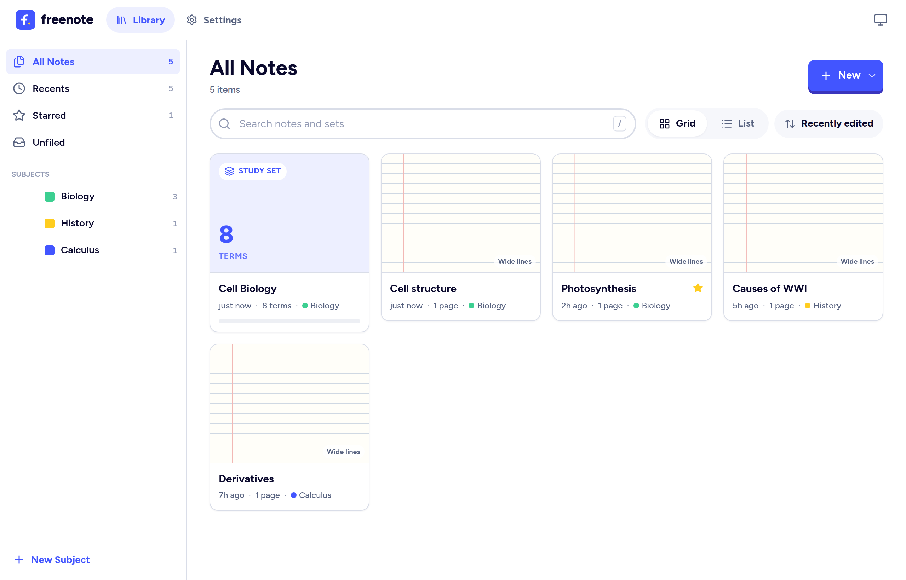
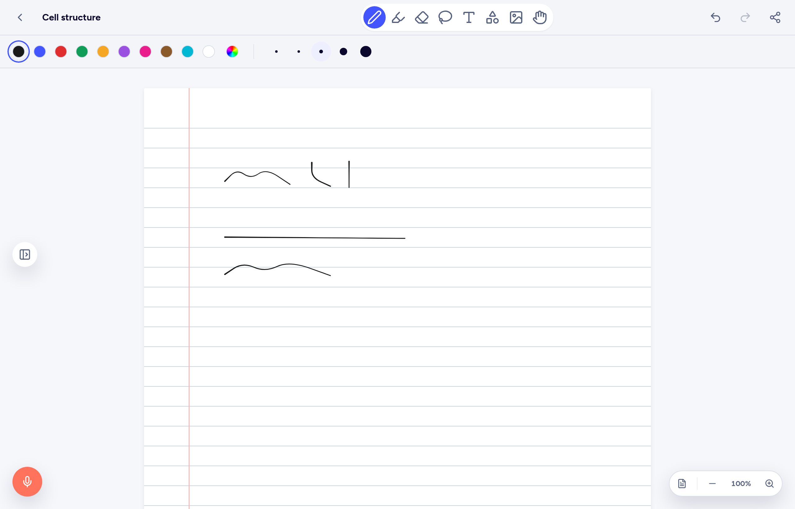
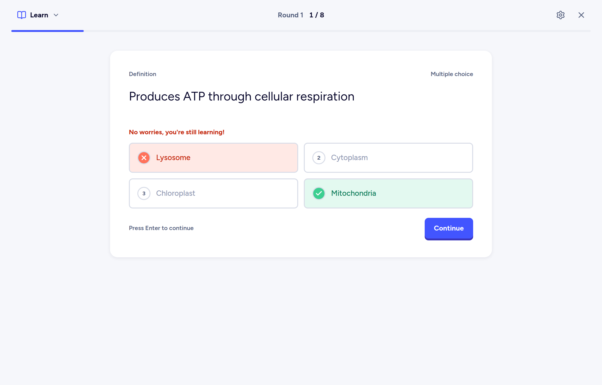

<div align="center">

# freenote

**Handwritten notes and flashcard study, in one app that keeps everything on your device.**

No account. No cloud. No tracking. No subscription.

[](https://vercel.com/new/clone?repository-url=https%3A%2F%2Fgithub.com%2Fndunl075%2Ffreenote)



</div>

---

## What is freenote?

freenote is a free, open-source app for taking notes and studying them.

It does two things:

**1. It's a notebook.** Write by hand with a stylus, finger, or mouse. Type text, drop in
pictures, draw shapes. Organise everything into subjects, the way you'd use tabbed dividers
in a real binder. You can even **record audio while you write** — so when you play a lecture
back later, you can see exactly what you were writing as each thing was said.

**2. It's a flashcard study app.** Turn what you've learned into study sets and drill them
five different ways: classic flashcards, a guided Learn mode that adapts to what you keep
getting wrong, a practice Test, a timed Match game, and an arcade mode called Blast.

If you've used Notability and Quizlet, freenote will feel immediately familiar. That's on
purpose.

## The part that makes it different

**Your notes never leave your computer.**

Most study apps store your work on their servers. freenote doesn't have servers. Everything
you write is saved inside your own web browser, on your own device, and it physically cannot
go anywhere else — there's no code in the app that sends data out, and the test suite checks
that every time we change anything.

What this means for you:

| | |
|---|---|
| **No sign-up** | Open it and start writing. There's no account to make. |
| **Works offline** | Once the page has loaded, you don't need internet. |
| **Nobody sees your notes** | Not us, not advertisers, not anyone. There's nothing to see. |
| **Nothing to cancel** | It's free, and it stays free. |

The trade-off is honest and worth knowing up front: **your notes live in one browser on one
device.** They don't sync to your phone automatically. If you clear your browser's site data,
they're gone. So freenote has a one-click **Back up everything** button that saves all your
notes and sets to a single file — keep that file somewhere safe, and you can restore
everything, or move it to another computer.

## What you can do

### Taking notes



- **Write by hand** with pressure-sensitive ink that thickens and thins like a real pen
- **Highlight** in six colours — highlighter always goes *behind* your writing, so it never
  covers it up
- **Erase** by swiping through a mistake; the whole stroke disappears, not a ragged fragment
- **Lasso** a chunk of writing to move it somewhere else
- **Add text boxes, pictures, shapes and sticky notes**
- **Draw a rough circle, box or line and hold still** — freenote snaps it to a clean shape
- **Choose your paper**: blank, ruled, grid, dotted, Cornell, or music staves — in white,
  cream, yellow, grey or black
- **Record audio while you write**, then scrub back through the lecture
- **Undo anything**, with a history that follows you across pages
- **Export** a note as a PDF or an image

### Studying



- **Flashcards** — flip through cards, swipe to sort them into "know it" and "still learning"
- **Learn** — adapts to you, starting with multiple choice and graduating to typing the
  answer as you improve
- **Test** — builds a practice exam and grades it
- **Match** — a timed game where you pair terms with definitions against the clock
- **Blast** — an arcade mode where definitions fall and you type the terms

### Staying organised

- Group notes and sets into **subjects and dividers**
- **Search** everything by title
- **Star** the things you come back to
- **Light and dark themes**, following your system by default

## Trying it out

freenote runs at whatever web address it's been published to — just open the link, and you're
in. Nothing to install, nothing to sign up for. Add it to your home screen and it behaves like
an ordinary app.

**On a tablet with a stylus,** turn on *Palm rejection* in Settings so you can rest your hand
on the screen while you write.

## Running your own copy

You don't need to do this to use freenote — but since it's open source, you can.

**If you just want it hosted for free:** press the *Deploy with Vercel* button at the top of
this page. It copies the project to your own GitHub account and puts it online, usually in
under two minutes, at no cost. You don't need to understand any of the code to do this.

You can also import an existing fork at [vercel.com/new](https://vercel.com/new) — Vercel
detects every setting automatically, because the project builds to plain static files.

**If you want to run it on your own machine,** you'll need
[Node.js](https://nodejs.org) 20 or newer:

```bash
git clone https://github.com/ndunl075/freenote.git
cd freenote
npm install -g pnpm     # if you don't have pnpm
pnpm install
pnpm dev
```

Then open <http://localhost:3000>.

To produce the finished files you could put on any web host:

```bash
pnpm build
```

That writes a folder called `out/` containing plain HTML, CSS and JavaScript. There's no
server component at all — you can drop that folder on any static host, or open it from a USB
stick.

## For developers

The design and structure are documented in **[ARCHITECTURE.md](./ARCHITECTURE.md)**.

```bash
pnpm dev         # development server
pnpm build       # static production build → out/
pnpm test        # unit tests (Vitest)
pnpm e2e         # browser tests (Playwright)
pnpm typecheck   # TypeScript
pnpm lint        # ESLint
```

Built with Next.js, TypeScript, Tailwind CSS, Framer Motion, Dexie (IndexedDB) and
perfect-freehand. Everything ships as a static export — there are no API routes and no server
runtime, which is what makes the privacy guarantee structural rather than a policy.

## A note on the apps that inspired this

freenote is an independent, open-source project. It is not affiliated with, endorsed by, or
connected to Notability or Quizlet in any way. Those are both good apps; this is a free
alternative for people who'd rather keep their notes on their own device.

## Licence

[MIT](./LICENSE) — do what you like with it.
